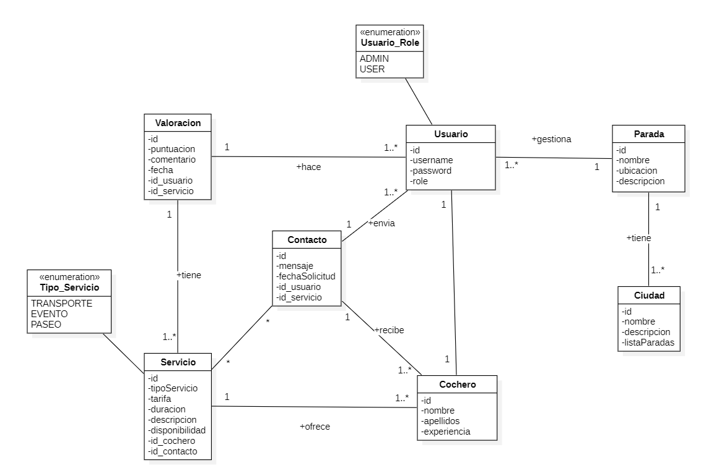

# Calesapp

**Calesapp** es una aplicación que conecta a turistas con cocheros de coches de caballos para facilitar la contratación de paseos por la ciudad. Ofrece una solución digital a un servicio tradicional, mejorando su accesibilidad y comunicación.

---

## Requisitos del sistema

Para ejecutar el proyecto localmente, asegúrate de tener instalado:

- Java Development Kit (JDK) 17  
- Apache Maven  
- Docker  
- Docker Compose  

---

## Puesta en marcha

1. Clonar el repositorio en tu máquina local:
   ```bash
   git clone https://github.com/alvaroloal/proyecto-calesapp.git
   cd proyecto-calesapp
   ```

2. Iniciar la base de datos:
   ```bash
   docker-compose up --build -d
   ```

3. Ejecutar la aplicación con Maven:
   ```bash
   mvn spring-boot:run
   ```

---

## Perfiles de configuración

La aplicación dispone de distintos perfiles de configuración que se adaptan al entorno de ejecución:

- **Desarrollo**
  ```bash
  docker-compose -f docker-compose-dev.yml up -d
  ```
  Ejecuta la aplicación en un contenedor Docker con acceso a PGAdmin, y muestra mensajes de consultas SQL en consola.

- **Producción**
  ```bash
  docker-compose -f docker-compose-prod.yml up -d
  ```
  Ejecuta la aplicación en un contenedor Docker sin mostrar las consultas SQL.

---

## Documentación de la API

- **Swagger UI**: [http://localhost:8080/swagger-ui.html](http://localhost:8080/swagger-ui.html)  
- **OpenAPI (JSON)**: [http://localhost:8080/v3/api-docs](http://localhost:8080/v3/api-docs)

---

## Colección de Postman

[`ProyectoCalesapp.postman_collection.json`](docs/ProyectoCalesapp.postman_collection.json)

---

## Pruebas de autenticación

Para acceder a los endpoints protegidos (usuario y administrador), sigue el siguiente flujo:

1. **Registro**: Al registrarse, se genera un token de verificación.
2. **Verificación**: Una vez verificado el registro, se habilita el acceso al inicio de sesión.
3. **Autenticación**: Al iniciar sesión, se genera un token JWT necesario para consumir los endpoints protegidos.

---

## Diseño de la Interfaz

Diseño UI de la aplicación web en Figma:

[Diseño UI CALESAPP](https://www.figma.com/design/j4B1QGaIhNnBDOHB3CKBqm/Calesa?node-id=0-1&t=THystnwQQcP75NMc-1)

---

## Descripción del problema

A dia de hoy, cuando alguien quiere alquilar un coche de caballo para un paseo por la ciudad el proceso es el siguiente, ir a la parada donde se encuentra el coche de caballo y contratar el servicio. 
Este modelo presenta varios problemas:

- Generalmente un turista desconoce la ubicacion de las paradas.
- Son muy pocos los cocheros que ofrecen sus servicios de manera particular por internet.
- No se conocen los detalles de antemano sobre el servicio. (tarifa, duración, disponibilidad).
- No hay valoraciones sobre como son los paseos en los coches de caballos.

---

## Motivación del proyecto

Aplicacion que pone en contacto a clientes con cocheros de coches de caballo para contratar sus servicios, ofreciendo:

- Localización de paradas.
- Plataforma para que los cocheros puedan publicar sus servicios.
- Información sobre tarifas, duración y disponibilidad.
- Sistema de valoración para que los usuarios evalúen los paseos.
- Canal de contacto entre clientes y cocheros.

---

## Requisitos funcionales

Se definen tres roles de usuario:

- **Visitante (no autenticado)**  
- **Usuario autenticado**  
- **Administrador**

### Funcionalidades según rol

#### Visitante
- Consultar las paradas disponibles.

#### Usuario autenticado
- Visualizar la información de los servicios ofrecidos por los cocheros.
- Buscar y contactar con un cochero.
- Valorar los servicios recibidos.

#### Administrador
- Gestionar (crear, actualizar, eliminar) paradas, servicios, contactos, cocheros, valoraciones y usuarios.

---

## Modelo de datos

Diagrama del modelo de datos:  


---

## Pruebas de `ParadaService`

El servicio `ParadaService` gestiona la lógica de negocio relacionada con las paradas. Las pruebas unitarias se realizan utilizando **JUnit 5** y **Mockito**, simulando las dependencias de `ParadaRepository` y `CiudadRepository`.

### Métodos probados

- `findAll()`: Verifica la recuperación de todas las paradas.
- `findById()`: Prueba la búsqueda por ID, tanto con resultados como sin ellos.
- `create()`: Valida la creación de una nueva parada a partir de un DTO.
- `update()`: Comprueba la actualización de una parada existente.
- `delete()`: Verifica la eliminación correcta de una parada existente.
