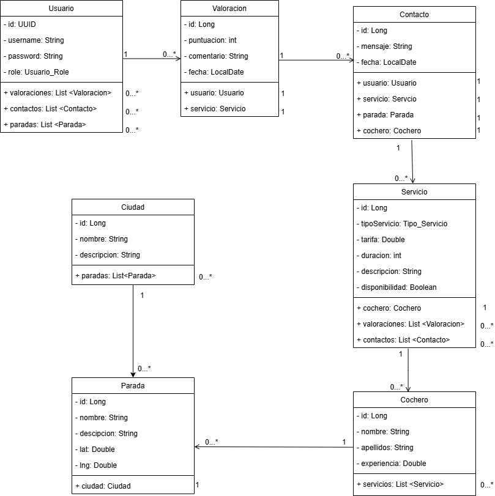
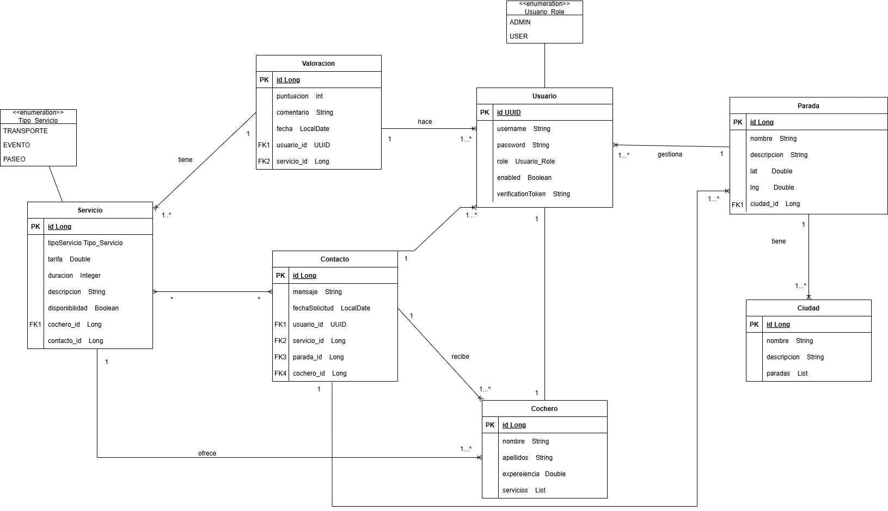

# Calesapp

**Calesapp** es una aplicación que conecta a turistas con cocheros de coches de caballos para facilitar la contratación de paseos por la ciudad. Ofrece un sistema de reservas para diferentes tipos de servicios en diferentes puntos de una ciudad con una flota de cocheros.

---
[Memoria del proyecto](docs/MemoriaPDAM-ÁlvaroLorenteAlmán.pdf)


## Requisitos del sistema

Para ejecutar el proyecto localmente, asegúrate de tener instalado:

- Java Development Kit (JDK) 17  
- Apache Maven  
- Docker  
- Docker Compose  
- Node Js

---

## Puesta en marcha

Clonar el repositorio en tu máquina local:
```bash
git clone https://github.com/alvaroloal/proyecto-calesapp.git
```
---

La aplicación dispone de dos perfiles de configuración que se adaptan al entorno de ejecución:

- **Desarrollo**
  ```bash
  docker-compose -f docker-compose-dev.yml up -d
  ```
  Ejecuta la aplicación en un contenedor Docker con acceso a PGAdmin, y muestra mensajes de consultas SQL en consola.

   Ejecutar docker-compose desde la raiz del repositorio:
  ```bash
  docker-compose -f docker-compose-dev.yml up -d --build
  ```
   
- **Producción**
  ```bash
  docker-compose -f docker-compose-prod.yml up -d
  ```
  Ejecuta la aplicación en un contenedor Docker sin mostrar las consultas SQL.


Para bajar los servicios y eliminar los recursos asociados basta con ejecutar la siguiente orden:
```bash
docker-compose -f docker-compose-dev.yml down --remove-orphans
```

---

## Documentación de la API
El acceso a la documentación de la api está protegido con autenticación. El usuario que tiene acceso es 'admin' con contraseña 'admin'.
- **Swagger UI**: [http://localhost:8080/swagger-ui.html](http://localhost:8080/swagger-ui.html)  
- **OpenAPI (JSON)**: [http://localhost:8080/v3/api-docs](http://localhost:8080/v3/api-docs)

---

## Colección de Postman

[`ProyectoCalesapp.postman_collection.json`](docs/ProyectoCalesapp.postman_collection.json)

---

## Pruebas de autenticación

Para acceder a los endpoints protegidos (usuario y administrador), hay que seguir el siguiente flujo:

1. **Registro**: Al registrarse, se genera un token de verificación.
2. **Verificación**: Una vez verificado el registro, se habilita el acceso al inicio de sesión.
3. **Autenticación**: Al iniciar sesión, se genera un token JWT necesario para consumir los endpoints protegidos.

---

## Diseño UI

[Diseño Figma](https://www.figma.com/design/j4B1QGaIhNnBDOHB3CKBqm/Calesa?node-id=0-1&t=THystnwQQcP75NMc-1)

[Diseño Excalidraw](https://excalidraw.com/#json=j7m9msPvdRWd-6Zuf8EvS,B9joBmUKhWV5y1Oaw0Jw9g)

---

## Diagramas





---

## Testing

El servicio `ParadaService` gestiona la lógica de negocio relacionada con las paradas. Las pruebas unitarias se realizan utilizando **JUnit 5** y **Mockito**, simulando las dependencias de `ParadaRepository` y `CiudadRepository`.

### Métodos probados

- `findAll()`: Verifica la recuperación de todas las paradas.
- `findById()`: Prueba la búsqueda por ID, tanto con resultados como sin ellos.
- `create()`: Valida la creación de una nueva parada a partir de un DTO.
- `update()`: Comprueba la actualización de una parada existente.
- `delete()`: Verifica la eliminación correcta de una parada existente.


