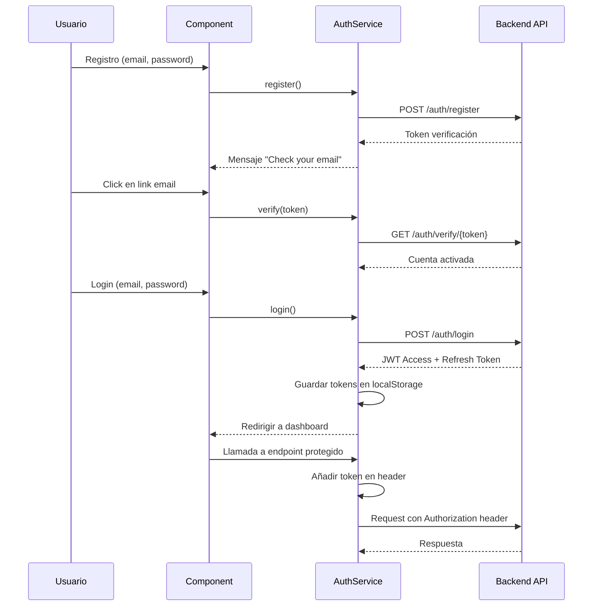
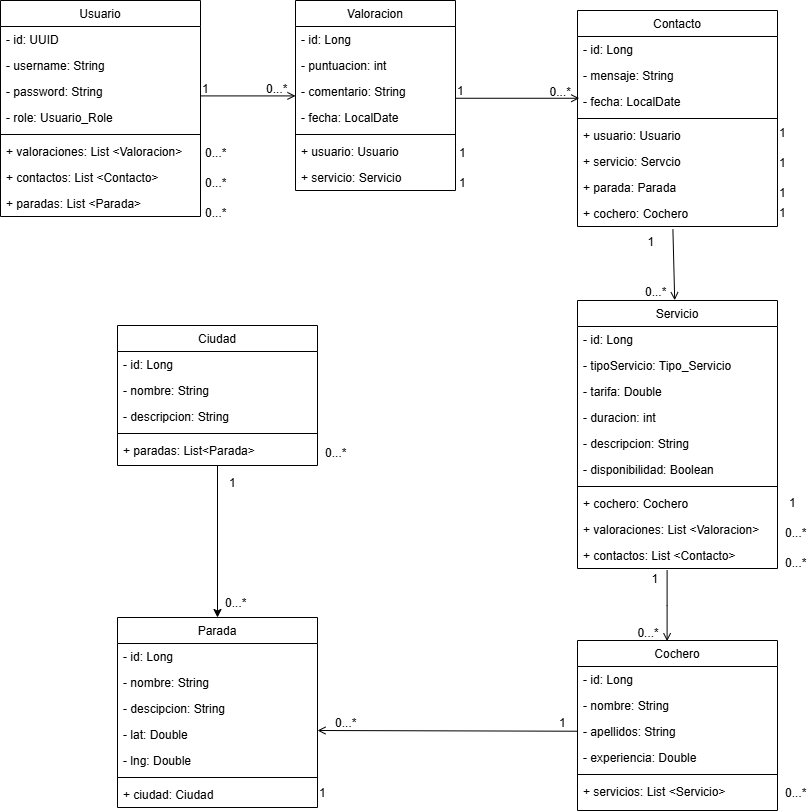
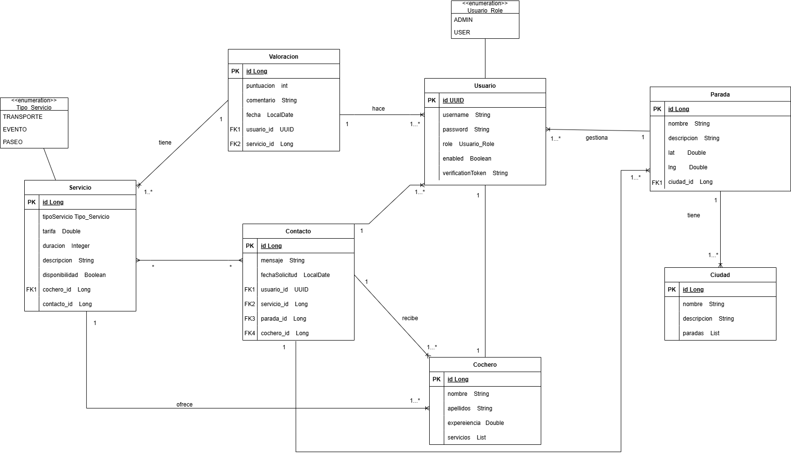

<div align="center">

# 🐴 Calesapp

### Sistema de reservas para paseos en Coche de Caballos

[](https://spring.io/projects/spring-boot)
[](https://angular.io/)
[](https://www.oracle.com/java/)
[](https://www.typescriptlang.org/)
[](https://www.postgresql.org/)
[](https://www.docker.com/)
[](LICENSE)

**Calesapp** es una aplicación full-stack que conecta a turistas con cocheros de coches de caballos para facilitar la contratación de paseos por la ciudad. Ofrece un sistema de reservas para diferentes tipos de servicios en diferentes puntos de una ciudad con una flota de cocheros.
</div>

---

## 📑 Índice

- [📄 Memoria del proyecto](#-memoria-del-proyecto)
- [🛠️ Tecnologías utilizadas](#️-tecnologías-utilizadas)
- [📁 Estructura del proyecto](#-estructura-del-proyecto)
- [⚙️ Requisitos del sistema](#️-requisitos-del-sistema)
- [🚀 Puesta en marcha](#-puesta-en-marcha)
- [💻 Desarrollo](#-desarrollo)
- [🏗️ Arquitectura](#️-arquitectura)
- [🌐 Acceso a servicios](#-acceso-a-servicios)
- [📖 Documentación de la API](#-documentación-de-la-api)
- [🔐 Autenticación y seguridad](#-autenticación-y-seguridad)
- [🎨 Diseño UI](#-diseño-ui)
- [📊 Diagramas](#-diagramas)
- [🧪 Testing](#-testing)
- [🔧 Configuración](#-configuración-avanzada)
- [🐳 Contenedores Docker](#-contenedores-docker)
- [👤 Autor](#-autor)
- [📄 Licencia](#-licencia)

---

## 📄 Memoria del proyecto

📥 [Descargar Memoria del Proyecto](docs/MemoriaPDAM-ÁlvaroLorenteAlmán.pdf)

---

## 🛠️ Tecnologías utilizadas

### Backend

| Tecnología | Versión | Propósito |
|------------|---------|-----------|
|  | 17 | Lenguaje de programación |
|  | 3.4.2 | Framework principal |
|  | 3.4.2 | Capa de persistencia |
|  | 6.x | Autenticación y autorización |
|  | Latest | Base de datos (prod/dev) |
|  | Latest | Base de datos en memoria (testing) |
|  | 0.12.6 | Tokens de autenticación |
|  | Latest | Reducción de boilerplate |
|  | Latest | Documentación automática |
|  | 5 | Testing unitario |
|  | Latest | Mocking para tests |
|  | Latest | Gestión de dependencias |

### Frontend

| Tecnología | Versión | Propósito |
|------------|---------|-----------|
|  | 19 | Framework JavaScript |
|  | 5.7 | Lenguaje de programación |
|  | 4.0 | Framework CSS |
|  | Latest | Programación reactiva |
|  | Latest | Alertas y modales |
|  | API | Integración de mapas |
|  | Latest | Decodificación JWT |
|  | Latest | Framework de testing |
|  | Latest | Test runner |

### Infraestructura

| Tecnología | Propósito |
|------------|-----------|
|  | Containerización |
|  | Orquestación de contenedores |
|  | Servidor web para frontend |
|  | Gestión de PostgreSQL |

---

## 📁 Estructura del proyecto

```
proyecto-calesapp/
├── calesapp/                           # Backend (Spring Boot)
│   ├── src/
│   │   ├── main/
│   │   │   ├── java/.../calesapp/
│   │   │   │   ├── config/            # Configuraciones
│   │   │   │   ├── controller/        # Controladores REST
│   │   │   │   ├── dto/               # Data Transfer Objects
│   │   │   │   ├── error/             # Manejo de excepciones
│   │   │   │   ├── files/             # Sistema de archivos (local/Imgur)
│   │   │   │   ├── model/             # Entidades de dominio
│   │   │   │   ├── repository/        # Repositorios JPA
│   │   │   │   ├── security/          # Seguridad y JWT
│   │   │   │   ├── service/           # Lógica de negocio
│   │   │   │   ├── specification/     # Especificaciones JPA
│   │   │   │   ├── user/              # Módulo de usuarios
│   │   │   │   └── validation/        # Validaciones personalizadas
│   │   │   └── resources/
│   │   │       └── application.properties
│   │   └── test/                      # Tests unitarios
│   ├── pom.xml
│   └── Dockerfile
│
├── proyecto-calesapp-ng/              # Frontend (Angular)
│   ├── src/
│   │   └── app/
│   │       ├── admin/                 # Panel de administración
│   │       ├── components/            # Componentes compartidos
│   │       │   ├── hero/
│   │       │   ├── login/
│   │       │   ├── register/
│   │       │   ├── verify-account/
│   │       │   └── mapa-paradas/
│   │       ├── core/                  # Layout y estructura
│   │       ├── models/                # Interfaces TypeScript
│   │       ├── pages/                 # Páginas principales
│   │       │   ├── cocheros/
│   │       │   ├── paradas/
│   │       │   ├── servicios/
│   │       │   ├── valoraciones/
│   │       │   └── contactos/
│   │       └── services/              # Servicios HTTP
│   ├── package.json
│   └── Dockerfile
│
├── docs/                              # Documentación
│   ├── diagrama-clases-dominio.drawio.png
│   ├── diagrama-entidad-relacion.drawio.png
│   └── ProyectoCalesapp.postman_collection.json
│
├── docker-compose-dev.yml             # Compose para desarrollo
├── docker-compose-prod.yml            # Compose para producción
└── README.md
```

---

## ⚙️ Requisitos del sistema

Para ejecutar el proyecto localmente, hay que tener instalado:

| Herramienta | Versión mínima | Propósito |
|-------------|----------------|-----------|
| ☕ **Java Development Kit (JDK)** | 17 | Compilar y ejecutar el backend |
| 📦 **Apache Maven** | 3.6+ | Gestión de dependencias Java |
| 🐳 **Docker** | 20.10+ | Containerización |
| 🐙 **Docker Compose** | 2.0+ | Orquestación de contenedores |
| 🟢 **Node.js** | 18+ | Ejecutar el frontend Angular |
| 📝 **npm** | 9+ | Gestión de dependencias Node |

### Verificar instalación

```bash
# java
java -version

# maven
mvn -version

# docker
docker --version
docker-compose --version

# node.js y npm
node --version
npm --version
```

---

## 🚀 Puesta en marcha

### 1️⃣ Clonar el repositorio

```bash
git clone https://github.com/alvaroloal/proyecto-calesapp.git
cd proyecto-calesapp
```

### 2️⃣ Elegir perfil de ejecución

La aplicación dispone de dos perfiles de configuración que se adaptan al entorno de ejecución:

#### 🛠️ Desarrollo

Ejecuta la aplicación con:
- ✅ Acceso a PGAdmin
- ✅ Mensajes de consultas SQL en consola
- ✅ Hot reload habilitado
- ✅ Datos de prueba precargados

```bash
docker-compose -f docker-compose-dev.yml up -d --build
```

#### 🚀 Producción

Ejecuta la aplicación con:
- ⚡ Optimización de rendimiento
- 🔒 Sin logging SQL
- 📦 Build optimizado del frontend
- 🔐 Configuración de seguridad reforzada

```bash
docker-compose -f docker-compose-prod.yml up -d --build
```

### 3️⃣ Verificar que los servicios están corriendo

```bash
# ver estado de los contenedores
docker-compose -f docker-compose-dev.yml ps

# ver logs en tiempo real
docker-compose -f docker-compose-dev.yml logs -f
```

### 4️⃣ Acceder a la aplicación

Una vez iniciados los servicios:

- 🌐 **Frontend**: http://localhost
- 🔌 **Backend API**: http://localhost:8080
- 📊 **PGAdmin**: http://localhost:5050 (solo en desarrollo)
- 📖 **Swagger UI**: http://localhost:8080/swagger-ui.html

### 🛑 Detener los servicios

```bash
# detener y eliminar contenedores
docker-compose -f docker-compose-dev.yml down

# detener, eliminar contenedores y volúmenes (limpieza completa)
docker-compose -f docker-compose-dev.yml down -v --remove-orphans
```

---

## 💻 Desarrollo

### ☕ Backend (Spring Boot)

#### Estructura de comandos

```bash
# navegar al directorio del backend
cd calesapp
```

#### 🏗️ Compilación y empaquetado

```bash
# compilar el proyecto (sin ejecutar tests)
./mvnw clean compile

# empaquetar el proyecto (genera JAR)
./mvnw clean package

# empaquetar sin ejecutar tests
./mvnw clean package -DskipTests

# limpiar build anterior
./mvnw clean
```

#### 🧪 Testing

```bash
# ejecutar todos los tests
./mvnw test

# ejecutar una clase de test específica
./mvnw test -Dtest=ParadaServiceTest

# ejecutar un método de test específico
./mvnw test -Dtest=ParadaServiceTest#testFindById

# ejecutar tests con coverage
./mvnw test jacoco:report

# ver reporte de cobertura
# el reporte se genera en: target/site/jacoco/index.html
```

#### ▶️ Ejecución

```bash
# ejecutar sin Docker (requiere PostgreSQL en localhost:5433)
./mvnw spring-boot:run

# ejecutar con perfil específico
./mvnw spring-boot:run -Dspring-boot.run.profiles=dev

# ejecutar en modo debug (puerto 5005)
./mvnw spring-boot:run -Dspring-boot.run.jvmArguments="-agentlib:jdwp=transport=dt_socket,server=y,suspend=n,address=*:5005"
```

#### 📝 Comandos útiles

```bash
# ver árbol de dependencias
./mvnw dependency:tree

# actualizar versiones de dependencias
./mvnw versions:display-dependency-updates

# validar formato de código
./mvnw spotless:check

# aplicar formato de código
./mvnw spotless:apply
```

### 🎨 Frontend (Angular)

#### Estructura de comandos

```bash
# navegar al directorio del frontend
cd proyecto-calesapp-ng
```

#### 📦 Instalación de dependencias

```bash
# instalar dependencias
npm install

# instalar una dependencia específica
npm install <package-name>

# instalar dependencia de desarrollo
npm install --save-dev <package-name>

# actualizar dependencias
npm update

# auditar vulnerabilidades
npm audit

# arreglar vulnerabilidades automáticamente
npm audit fix
```

#### ▶️ Servidor de desarrollo

```bash
# iniciar servidor de desarrollo (http://localhost:4200)
npm start

# iniciar con configuración específica
ng serve --configuration=development

# iniciar en puerto específico
ng serve --port 4300

# abrir automáticamente en navegador
ng serve --open

# modo con proxy para API
ng serve --proxy-config proxy.conf.json
```

#### 🏗️ Build

```bash
# build de desarrollo
npm run build

# build de producción
ng build --configuration=production

# build con análisis de bundle
ng build --stats-json
npm run analyze

# ver tamaño del bundle
npm run build -- --source-map
```

#### 🧪 Testing

```bash
# ejecutar tests unitarios
npm test

# ejecutar tests con coverage
npm run test:coverage
# reporte en: coverage/index.html

# ejecutar tests en modo headless (para CI)
npm run test:ci

# ejecutar tests e2e
npm run e2e
```
---

## 🏗️ Arquitectura

### 📐 Modelo de dominio

La aplicación está construida alrededor de las siguientes entidades principales:

#### Entidades principales

##### 👤 Usuario
- **Propósito**: Gestión de usuarios con sistema de roles
- **Roles disponibles**: `USER`, `ADMIN`
- **Características**:
  - Sistema de verificación por email con tokens
  - Autenticación JWT
  - Gestión de contraseñas con BCrypt
- **Atributos clave**: `username`, `email`, `password`, `role`, `enabled`, `verificationToken`

##### 🤠 Cochero
- **Propósito**: Información de conductores de coches de caballos
- **Características**:
  - Datos personales y de contacto
  - Asociación a una ciudad específica
  - Gestión de servicios ofrecidos
  - Sistema de valoraciones
- **Atributos clave**: `nombre`, `apellidos`, `telefono`, `email`, `ciudad`, `servicios`

##### 📍 Parada
- **Propósito**: Puntos de recogida/entrega en la ciudad
- **Características**:
  - Coordenadas GPS (latitud, longitud)
  - Descripción y dirección
  - Asociación a ciudad
  - Capacidad de gestionar múltiples contactos
- **Atributos clave**: `nombre`, `direccion`, `latitud`, `longitud`, `ciudad`

##### 🎫 Servicio
- **Propósito**: Servicios ofrecidos por los cocheros
- **Tipos disponibles**:
  - `CITY_TOUR` - Paseo turístico por la ciudad
  - `SPECIAL_EVENT` - Evento especial (bodas, celebraciones)
  - `TRANSFER` - Traslado punto a punto
  - `CUSTOM` - Servicio personalizado
- **Características**:
  - Descripción detallada
  - Precio y duración
  - Sistema de valoraciones
  - Imagen del servicio
- **Atributos clave**: `nombre`, `descripcion`, `precio`, `duracion`, `tipo`, `cochero`

##### 📧 Contacto
- **Propósito**: Solicitudes de reserva/contacto
- **Características**:
  - Vincula usuarios con servicios, paradas o cocheros
  - Fecha y hora de reserva
  - Mensaje personalizado
  - Sistema de estados (pendiente, confirmado, cancelado)
- **Atributos clave**: `usuario`, `servicio`, `parada`, `cochero`, `fecha`, `mensaje`

##### ⭐ Valoracion
- **Propósito**: Sistema de reseñas y puntuaciones
- **Características**:
  - Puntuación (1-5 estrellas)
  - Comentario del usuario
  - Fecha de creación
  - Asociada a un servicio y usuario
- **Atributos clave**: `puntuacion`, `comentario`, `usuario`, `servicio`, `fecha`

##### 🏙️ Ciudad
- **Propósito**: Ciudades donde operan los servicios
- **Características**:
  - Gestión de paradas
  - Gestión de cocheros
  - Información geográfica
- **Atributos clave**: `nombre`, `provincia`, `comunidadAutonoma`, `paradas`, `cocheros`

#### 🔗 Relaciones del modelo

```
Usuario (1) ────< (N) Contacto
Usuario (1) ────< (N) Valoracion

Cochero (1) ────< (N) Servicio
Cochero (N) ────> (1) Ciudad

Servicio (1) ────< (N) Valoracion
Servicio (1) ────< (N) Contacto
Servicio (N) ────> (1) Cochero

Parada (1) ────< (N) Contacto
Parada (N) ────> (1) Ciudad

Ciudad (1) ────< (N) Parada
Ciudad (1) ────< (N) Cochero
```

#### 💡 Reglas de negocio importantes

1. **Usuario**:
   - Debe verificar su email antes de poder iniciar sesión
   - Las contraseñas se almacenan hasheadas con BCrypt
   - Los tokens JWT tienen caducidad configurable

2. **Contacto**:
   - Puede estar asociado a un Servicio, una Parada o un Cochero
   - No es obligatorio especificar los tres
   - La fecha de contacto debe ser futura

3. **Valoracion**:
   - Solo usuarios autenticados pueden crear valoraciones
   - La puntuación debe estar entre 1 y 5
   - Un usuario puede valorar el mismo servicio múltiples veces

4. **Servicio**:
   - Debe tener un cochero asociado
   - El precio debe ser positivo
   - La duración se expresa en minutos

### 🔧 Arquitectura Backend

El backend sigue una **arquitectura en capas** (Layered Architecture) con separación clara de responsabilidades:

```
┌─────────────────────────────────────────┐
│     Capa de Presentación (REST API)    │
│           /controller                   │
│  - Endpoints REST                       │
│  - Validación de entrada                │
│  - Conversión DTOs ↔ Entidades         │
│  - Manejo de HTTP                       │
└─────────────────────────────────────────┘
                  ↓
┌─────────────────────────────────────────┐
│      Capa de Negocio (Business)        │
│            /service                     │
│  - Lógica de negocio                    │
│  - Transacciones (@Transactional)       │
│  - Validaciones complejas               │
│  - Orquestación de operaciones          │
└─────────────────────────────────────────┘
                  ↓
┌─────────────────────────────────────────┐
│    Capa de Persistencia (Data Access)  │
│          /repository                    │
│  - Repositorios Spring Data JPA         │
│  - Consultas personalizadas (@Query)    │
│  - Specifications (búsquedas dinámicas) │
│  - Gestión de transacciones DB          │
└─────────────────────────────────────────┘
                  ↓
┌─────────────────────────────────────────┐
│         Base de Datos PostgreSQL        │
└─────────────────────────────────────────┘
```

#### 📦 Módulos principales

##### 🔐 Seguridad (`/security`)
- **JWT Authentication**: Tokens de acceso y refresh separados
- **Password Encoding**: BCrypt para hashing de contraseñas
- **Role-Based Access Control (RBAC)**: Roles USER y ADMIN
- **Verification System**: Tokens de verificación por email
- **Componentes clave**:
  - `JwtTokenProvider`: Generación y validación de tokens
  - `JwtAuthenticationFilter`: Filtro para validar tokens en requests
  - `SecurityConfig`: Configuración de Spring Security
  - `UserDetailsServiceImpl`: Carga de usuarios para autenticación

##### 📁 Sistema de Archivos (`/files`)
- **Abstracción**: Interfaz `StorageService`
- **Implementaciones**:
  - `LocalStorageService`: Almacenamiento local en `./uploads`
  - `ImgurStorageService`: Subida a API de Imgur
- **Configuración**: Seleccionable via `application.properties`
- **Límites**: 5MB por archivo, 10MB por request

##### ✅ Validaciones (`/validation`)
Validaciones personalizadas con anotaciones:
- `@EmailBasico`: Validación de formato email
- `@FechaPasada`: Verifica fecha en el pasado
- `@FechaFutura`: Verifica fecha en el futuro
- `@SinPalabrasProhibidas`: Filtrado de contenido

##### 🔍 Búsquedas Dinámicas (`/specification`)
- Patrón **Specification** de Spring Data JPA
- Permite combinar múltiples criterios de búsqueda
- Implementado en `Parada` y `Cochero`
- Uso de `SearchCriteria` para construir consultas dinámicas

##### ⚠️ Manejo de Errores (`/error`)
- `GlobalExceptionHandler`: Manejo centralizado de excepciones
- Respuestas de error estandarizadas
- Logging de errores
- Códigos HTTP apropiados

#### 📡 Endpoints principales

| Entidad | Base Path | Descripción |
|---------|-----------|-------------|
| **Auth** | `/auth` | Registro, login, verificación |
| **Usuario** | `/usuarios` | CRUD de usuarios |
| **Cochero** | `/cocheros` | CRUD de cocheros + búsqueda |
| **Parada** | `/paradas` | CRUD de paradas + búsqueda |
| **Servicio** | `/servicios` | CRUD de servicios |
| **Contacto** | `/contactos` | CRUD de contactos/reservas |
| **Valoracion** | `/valoraciones` | CRUD de valoraciones |
| **Ciudad** | `/ciudades` | CRUD de ciudades |

---

### 🎨 Arquitectura Frontend

La aplicación Angular está organizada por **características** (Feature Modules) siguiendo las mejores prácticas de Angular:

```
src/app/
├── core/                    # Módulo core (singleton)
│   ├── layout/             # Componentes de layout
│   │   ├── header/
│   │   ├── footer/
│   │   └── sidebar/
│   └── interceptors/       # HTTP interceptors
│
├── components/             # Componentes compartidos
│   ├── hero/              # Landing hero section
│   ├── login/             # Componente de login
│   ├── register/          # Componente de registro
│   ├── verify-account/    # Verificación de cuenta
│   └── mapa-paradas/      # Mapa de Google Maps
│
├── pages/                  # Feature modules
│   ├── cocheros/          # Gestión de cocheros
│   ├── paradas/           # Gestión de paradas
│   ├── servicios/         # Gestión de servicios
│   ├── valoraciones/      # Sistema de valoraciones
│   └── contactos/         # Sistema de reservas
│
├── admin/                  # Panel de administración
│   └── dashboard/         # Dashboard administrativo
│
├── services/              # Servicios HTTP
│   ├── auth.service.ts
│   ├── cocheros.service.ts
│   ├── paradas.service.ts
│   ├── servicios.service.ts
│   └── ...
│
└── models/                # Interfaces TypeScript
    ├── usuario.interface.ts
    ├── cochero.interface.ts
    └── ...
```

#### 🔄 Flujo de datos

```
Component → Service → HTTP Client → Backend API
    ↓          ↓          ↓              ↓
  Template   RxJS    Interceptors    Response
             Observable
```

#### 🔐 Flujo de autenticación


```mermaid
sequenceDiagram
    participant U as Usuario
    participant C as Component
    participant A as AuthService
    participant B as Backend API

    U->>C: Registro (email, password)
    C->>A: register()
    A->>B: POST /auth/register
    B-->>A: Token verificación
    A-->>C: Mensaje "Check your email"

    U->>C: Click en link email
    C->>A: verify(token)
    A->>B: GET /auth/verify/{token}
    B-->>A: Cuenta activada

    U->>C: Login (email, password)
    C->>A: login()
    A->>B: POST /auth/login
    B-->>A: JWT Access + Refresh Token
    A->>A: Guardar tokens en localStorage
    A-->>C: Redirigir a dashboard

    C->>A: Llamada a endpoint protegido
    A->>A: Añadir token en header
    A->>B: Request con Authorization header
    B-->>A: Respuesta
```

#### 📡 HTTP Interceptors

- **AuthInterceptor**: Añade automáticamente el token JWT a todas las peticiones
- **ErrorInterceptor**: Manejo centralizado de errores HTTP
- **LoadingInterceptor**: Muestra spinner durante llamadas HTTP

#### 🗺️ Integración con Google Maps

- Servicio `GoogleMapsLoaderService` para carga dinámica
- Componente `mapa-paradas` para visualización de ubicaciones
- Markers personalizados para paradas
- InfoWindows con información de cada parada

---

## 🌐 Acceso a servicios

Una vez levantados los servicios con Docker Compose, puedes acceder a:

### 🖥️ Aplicación

| Servicio | URL | Puerto | Descripción |
|----------|-----|--------|-------------|
| 🌐 **Frontend** | http://localhost | 80 | Aplicación Angular |
| 🔌 **Backend API** | http://localhost:8080 | 8080 | API REST Spring Boot |
| 📖 **Swagger UI** | http://localhost:8080/swagger-ui.html | 8080 | Documentación interactiva |
| 📊 **PGAdmin** | http://localhost:5050 | 5050 | Gestión de PostgreSQL (dev) |

### 🗄️ Base de datos

#### PostgreSQL
```yaml
Host: localhost
Port: 5433
Database: calesappdb
Usuario: <configurado en docker-compose>
Contraseña: <configurado en docker-compose>
```

**Conexión desde aplicación externa:**
```bash
psql -h localhost -p 5433 -U <usuario> -d calesappdb
```

#### PGAdmin (Solo en desarrollo)
```yaml
URL: http://localhost:5050
Email: <configurado en docker-compose>
Password: <configurado en docker-compose>
```

**Configurar servidor en PGAdmin:**
1. Nombre: Calesapp DB
2. Host: `postgres` (nombre del contenedor)
3. Puerto: `5432` (puerto interno del contenedor)
4. Usuario y contraseña: según docker-compose

---

## 📖 Documentación de la API

### 📚 Swagger UI / OpenAPI

La API está completamente documentada usando **OpenAPI 3.0** (Swagger):

- **Swagger UI**: http://localhost:8080/swagger-ui.html
- **OpenAPI JSON**: http://localhost:8080/v3/api-docs
- **OpenAPI YAML**: http://localhost:8080/v3/api-docs.yaml

#### Características de la documentación:

✅ Todos los endpoints documentados
✅ Esquemas de request/response
✅ Códigos de estado HTTP
✅ Ejemplos de peticiones
✅ Autenticación JWT integrada
✅ Try it out! funcional

### 📮 Colección de Postman

Colección completa con todos los endpoints:

📥 [Descargar colección](docs/ProyectoCalesapp.postman_collection.json)

### 🔍 Endpoints principales

#### 🔐 Autenticación (`/auth`)

| Método | Endpoint | Descripción | Auth requerida |
|--------|----------|-------------|----------------|
| POST | `/auth/register` | Registrar nuevo usuario | ❌ |
| GET | `/auth/verify/{token}` | Verificar cuenta por email | ❌ |
| POST | `/auth/login` | Iniciar sesión (obtener JWT) | ❌ |
| POST | `/auth/refresh` | Refrescar token JWT | ✅ |

#### 👤 Usuarios (`/usuarios`)

| Método | Endpoint | Descripción | Roles |
|--------|----------|-------------|-------|
| GET | `/usuarios` | Listar usuarios | ADMIN |
| GET | `/usuarios/{id}` | Obtener usuario | USER, ADMIN |
| PUT | `/usuarios/{id}` | Actualizar usuario | USER, ADMIN |
| DELETE | `/usuarios/{id}` | Eliminar usuario | ADMIN |

#### 🤠 Cocheros (`/cocheros`)

| Método | Endpoint | Descripción | Auth |
|--------|----------|-------------|------|
| GET | `/cocheros` | Listar cocheros | ❌ |
| GET | `/cocheros/{id}` | Obtener cochero | ❌ |
| POST | `/cocheros` | Crear cochero | ADMIN |
| PUT | `/cocheros/{id}` | Actualizar cochero | ADMIN |
| DELETE | `/cocheros/{id}` | Eliminar cochero | ADMIN |
| GET | `/cocheros/search` | Búsqueda dinámica | ❌ |

#### 📍 Paradas (`/paradas`)

| Método | Endpoint | Descripción | Auth |
|--------|----------|-------------|------|
| GET | `/paradas` | Listar paradas | ❌ |
| GET | `/paradas/{id}` | Obtener parada | ❌ |
| POST | `/paradas` | Crear parada | ADMIN |
| PUT | `/paradas/{id}` | Actualizar parada | ADMIN |
| DELETE | `/paradas/{id}` | Eliminar parada | ADMIN |
| GET | `/paradas/search` | Búsqueda dinámica | ❌ |

#### 🎫 Servicios (`/servicios`)

| Método | Endpoint | Descripción | Auth |
|--------|----------|-------------|------|
| GET | `/servicios` | Listar servicios | ❌ |
| GET | `/servicios/{id}` | Obtener servicio | ❌ |
| POST | `/servicios` | Crear servicio | ADMIN |
| PUT | `/servicios/{id}` | Actualizar servicio | ADMIN |
| DELETE | `/servicios/{id}` | Eliminar servicio | ADMIN |

#### 📧 Contactos (`/contactos`)

| Método | Endpoint | Descripción | Auth |
|--------|----------|-------------|------|
| GET | `/contactos` | Listar contactos | USER |
| GET | `/contactos/{id}` | Obtener contacto | USER |
| POST | `/contactos` | Crear contacto | USER |
| PUT | `/contactos/{id}` | Actualizar contacto | USER |
| DELETE | `/contactos/{id}` | Eliminar contacto | USER |

#### ⭐ Valoraciones (`/valoraciones`)

| Método | Endpoint | Descripción | Auth |
|--------|----------|-------------|------|
| GET | `/valoraciones` | Listar valoraciones | ❌ |
| GET | `/valoraciones/{id}` | Obtener valoración | ❌ |
| POST | `/valoraciones` | Crear valoración | USER |
| PUT | `/valoraciones/{id}` | Actualizar valoración | USER |
| DELETE | `/valoraciones/{id}` | Eliminar valoración | USER, ADMIN |
| GET | `/valoraciones/servicio/{id}` | Valoraciones por servicio | ❌ |

---

## 🔐 Autenticación y seguridad

### 🔑 Sistema de autenticación JWT

La aplicación utiliza **JSON Web Tokens (JWT)** para la autenticación:

#### Tipos de tokens

1. **Access Token**:
   - Duración: 1 hora (configurable)
   - Uso: Autenticación en endpoints protegidos
   - Se envía en header `Authorization: Bearer <token>`

2. **Refresh Token**:
   - Duración: 7 días (configurable)
   - Uso: Renovar access token sin login
   - Se almacena en localStorage

#### Flujo de autenticación completo

```
1. REGISTRO
   POST /auth/register
   Body: { "username": "...", "email": "...", "password": "..." }
   Response: { "message": "Usuario registrado. Verifica tu email." }

2. VERIFICACIÓN
   Usuario recibe email con token de verificación
   GET /auth/verify/{verification_token}
   Response: { "message": "Cuenta verificada exitosamente" }

3. LOGIN
   POST /auth/login
   Body: { "username": "...", "password": "..." }
   Response: {
     "accessToken": "eyJhbGc...",
     "refreshToken": "eyJhbGc...",
     "username": "...",
     "role": "USER"
   }

4. ACCESO A ENDPOINTS PROTEGIDOS
   GET /usuarios/me
   Headers: { "Authorization": "Bearer eyJhbGc..." }
   Response: { datos del usuario }

5. RENOVAR TOKEN (cuando access token expira)
   POST /auth/refresh
   Body: { "refreshToken": "eyJhbGc..." }
   Response: { "accessToken": "nuevo_token..." }
```

### 🔒 Seguridad implementada

#### Backend

✅ **Password hashing** con BCrypt (factor 12)
✅ **JWT con firma HMAC-SHA256**
✅ **CORS configurado** para frontend
✅ **Validación de entrada** en todos los endpoints
✅ **SQL Injection** prevenido con JPA
✅ **XSS** prevenido con validaciones
✅ **Rate limiting** (recomendado para producción)
✅ **HTTPS** (configurar en producción)

#### Frontend

✅ **Tokens en localStorage** (considerar httpOnly cookies para producción)
✅ **Interceptores HTTP** para añadir tokens
✅ **Guards de rutas** para proteger páginas
✅ **Validación de formularios** client-side
✅ **Sanitización de inputs**
✅ **Redirección automática** en caso de token inválido

### ⚠️ Consideraciones de seguridad para producción

1. **Cambiar JWT secret** en `application.properties`:
   ```properties
   jwt.secret=<generar_secreto_seguro_256_bits>
   jwt.access.duration=3600000  # 1 hora
   jwt.refresh.duration=604800000  # 7 días
   ```

2. **Usar HTTPS** en todos los entornos
3. **Configurar CORS** restrictivamente
4. **Implementar rate limiting** para evitar ataques de fuerza bruta
5. **Usar httpOnly cookies** en lugar de localStorage para tokens
6. **Habilitar CSRF protection**
7. **Implementar logging de seguridad**
8. **Configurar base de datos** con usuario de solo lectura cuando sea posible
9. **Variables de entorno** para datos sensibles
10. **Auditoría de dependencias** regular (`npm audit`, `mvn dependency-check`)

### 👮 Roles y permisos

| Recurso | Operación | USER | ADMIN | Público |
|---------|-----------|------|-------|---------|
| Auth | Register, Login | ✅ | ✅ | ✅ |
| Usuarios | Listar | ❌ | ✅ | ❌ |
| Usuarios | Ver propio perfil | ✅ | ✅ | ❌ |
| Usuarios | Editar propio perfil | ✅ | ✅ | ❌ |
| Usuarios | Eliminar | ❌ | ✅ | ❌ |
| Cocheros | Listar/Ver | ✅ | ✅ | ✅ |
| Cocheros | Crear/Editar/Eliminar | ❌ | ✅ | ❌ |
| Paradas | Listar/Ver | ✅ | ✅ | ✅ |
| Paradas | Crear/Editar/Eliminar | ❌ | ✅ | ❌ |
| Servicios | Listar/Ver | ✅ | ✅ | ✅ |
| Servicios | Crear/Editar/Eliminar | ❌ | ✅ | ❌ |
| Contactos | Listar propios | ✅ | ✅ | ❌ |
| Contactos | Crear propios | ✅ | ✅ | ❌ |
| Contactos | Ver todos | ❌ | ✅ | ❌ |
| Valoraciones | Listar/Ver | ✅ | ✅ | ✅ |
| Valoraciones | Crear propias | ✅ | ✅ | ❌ |
| Valoraciones | Eliminar cualquiera | ❌ | ✅ | ❌ |

---

## 🎨 Diseño UI

### 🎯 Prototipado y Wireframes

El diseño de la interfaz de usuario se ha desarrollado utilizando herramientas de prototipado:

#### Figma (Diseño completo)
🔗 [Ver diseño en Figma](https://www.figma.com/design/j4B1QGaIhNnBDOHB3CKBqm/Calesa?node-id=0-1&t=THystnwQQcP75NMc-1)

**Incluye:**
- ✨ Diseño completo de todas las pantallas
- 🎨 Paleta de colores
- 📝 Tipografía y espaciados
- 🖼️ Componentes reutilizables
- 📱 Versiones responsive (Desktop, Tablet, Mobile)

#### Excalidraw (Bocetos iniciales)
🔗 [Ver bocetos en Excalidraw](https://excalidraw.com/#json=j7m9msPvdRWd-6Zuf8EvS,B9joBmUKhWV5y1Oaw0Jw9g)

**Incluye:**
- ✏️ Wireframes iniciales
- 🔄 Flujos de usuario
- 💡 Conceptos de arquitectura UI
---

## 📊 Diagramas

### 📐 Diagrama de Clases de Dominio



**Muestra:**
- Entidades del modelo de dominio
- Atributos y tipos de datos
- Relaciones entre entidades
- Cardinalidades

### 🗄️ Diagrama Entidad-Relación



**Muestra:**
- Esquema de base de datos
- Tablas y columnas
- Claves primarias y foráneas
- Índices y constraints

---

## 🧪 Testing

### ☕ Backend (JUnit 5 & Mockito)

Las pruebas unitarias del backend utilizan **JUnit 5** y **Mockito** para simular dependencias y verificar la lógica de negocio.

#### 📂 Ubicación de los tests

```
calesapp/src/test/java/
└── com/salesianostriana/dam/calesapp/
    ├── service/
    │   ├── ParadaServiceTest.java
    │   ├── CocheroServiceTest.java
    │   └── ServicioServiceTest.java
    └── controller/
        └── ...
```

#### 🧩 Ejemplo: ParadaServiceTest

El servicio `ParadaService` gestiona la lógica de negocio relacionada con las paradas. Las pruebas simulan las dependencias de `ParadaRepository` y `CiudadRepository`.

**Métodos probados:**

| Test | Descripción | Cobertura |
|------|-------------|-----------|
| `testFindAll()` | Verifica la recuperación de todas las paradas | ✅ Happy path |
| `testFindById()` | Prueba la búsqueda por ID (con y sin resultados) | ✅ Happy + Error |
| `testCreate()` | Valida la creación de una nueva parada desde DTO | ✅ Happy path |
| `testUpdate()` | Comprueba la actualización de parada existente | ✅ Happy path |
| `testDelete()` | Verifica la eliminación correcta de parada | ✅ Happy path |

#### 🏃 Ejecutar tests

```bash
# todos los tests
cd calesapp
./mvnw test

# test específico
./mvnw test -Dtest=ParadaServiceTest

# con coverage (JaCoCo)
./mvnw test jacoco:report
# ver reporte en: target/site/jacoco/index.html
```

#### 📊 Cobertura de tests

```
Service Layer: ~80% coverage
Repository Layer: JPA (no tests necesarios)
Controller Layer: Tests de integración recomendados
```

---

### 🎨 Frontend (Jasmine & Karma)

El frontend utiliza **Jasmine** como framework de testing y **Karma** como test runner.

#### 📂 Estructura de tests

```
proyecto-calesapp-ng/src/app/
├── services/
│   ├── auth.service.spec.ts
│   ├── cocheros.service.spec.ts
│   └── ...
├── components/
│   ├── login/login.component.spec.ts
│   └── ...
└── pages/
    └── ...
```

#### 🏃 Ejecutar tests

```bash
cd proyecto-calesapp-ng

# modo interactivo (watch mode)
npm test

# modo CI (headless)
npm run test:ci

# con coverage
npm run test:coverage
# ver reporte en: coverage/index.html
```

#### 📊 Tipos de tests

| Tipo | Herramienta | Propósito |
|------|-------------|-----------|
| **Unitarios** | Jasmine | Servicios, componentes aislados |
| **Integración** | Jasmine + TestBed | Componentes con dependencias |
| **E2E** | Cypress (recomendado) | Flujos completos de usuario |
---

## 🔧 Configuración avanzada

### ⚙️ Variables de entorno

#### Crear archivo .env

Crea un archivo `.env` en la raíz del proyecto para configurar variables:

```bash
# ejemplo de archivo .env

# imgur Configuration
IMGUR_CLIENTID=your_imgur_client_id_here

# database Configuration
DB_HOST=localhost
DB_PORT=5433
DB_NAME=calesappdb
DB_USER=calesapp_user
DB_PASSWORD=your_secure_password_here

# JWT Configuration
JWT_SECRET=your_jwt_secret_256_bits_minimum_here
JWT_ACCESS_DURATION=3600000   # 1 hora en ms
JWT_REFRESH_DURATION=604800000  # 7 días en ms

# application Configuration
SPRING_PROFILES_ACTIVE=dev,pgsql
SERVER_PORT=8080
```

⚠️ **Importante**:
- Nunca incluyas el archivo `.env` en el control de versiones
- Genera secretos seguros con herramientas como `openssl rand -base64 32`
- Usa variables de entorno diferentes para cada entorno (dev, prod)

#### Usar variables en application.properties

```properties
# application.properties
jwt.secret=${JWT_SECRET:default_secret_only_for_dev}
jwt.access.duration=${JWT_ACCESS_DURATION:3600000}
jwt.refresh.duration=${JWT_REFRESH_DURATION:604800000}

spring.datasource.url=jdbc:postgresql://${DB_HOST:localhost}:${DB_PORT:5433}/${DB_NAME:calesappdb}
spring.datasource.username=${DB_USER:postgres}
spring.datasource.password=${DB_PASSWORD:password}
```

### 🗄️ Configuración de base de datos

#### Modos de actualización de esquema

```properties
# recrear esquema en cada inicio (desarrollo - datos se pierden)
spring.jpa.hibernate.ddl-auto=create-drop

# actualizar esquema sin perder datos (recomendado para dev)
spring.jpa.hibernate.ddl-auto=update

# validar esquema sin cambios (recomendado para producción)
spring.jpa.hibernate.ddl-auto=validate

# no hacer nada (producción con migrations)
spring.jpa.hibernate.ddl-auto=none
```

#### Configurar pool de conexiones

```properties
# hikariCP Configuration (default en Spring Boot)
spring.datasource.hikari.maximum-pool-size=10
spring.datasource.hikari.minimum-idle=5
spring.datasource.hikari.connection-timeout=30000
spring.datasource.hikari.idle-timeout=600000
spring.datasource.hikari.max-lifetime=1800000
```

### 📋 Perfiles de configuración

El backend soporta diferentes perfiles de Spring:

| Perfil | Propósito | Características |
|--------|-----------|----------------|
| **dev** | Desarrollo | Logging SQL activado, datos de prueba |
| **prod** | Producción | Sin logging SQL, optimizaciones |
| **pgsql** | PostgreSQL | Configuración específica para PostgreSQL |
| **h2** | Testing | Base de datos en memoria |

#### Activar perfiles

**application.properties:**
```properties
spring.profiles.active=dev,pgsql
```

**Línea de comandos:**
```bash
java -jar app.jar --spring.profiles.active=prod,pgsql
```

**Docker Compose:**
```yaml
environment:
  - SPRING_PROFILES_ACTIVE=prod,pgsql
```

### 📁 Sistema de archivos

El proyecto soporta dos estrategias de almacenamiento:

#### 1. Almacenamiento Local (por defecto)

```properties
# application.properties
storage.type=local
storage.location=./uploads
spring.servlet.multipart.max-file-size=5MB
spring.servlet.multipart.max-request-size=10MB
```

**Configurar en Docker:**
```yaml
volumes:
  - ./uploads:/app/uploads
```

#### 2. Almacenamiento en Imgur

```properties
# application.properties
storage.type=imgur
imgur.clientid=${IMGUR_CLIENTID}
spring.servlet.multipart.max-file-size=5MB
spring.servlet.multipart.max-request-size=10MB
```

**Obtener Client ID de Imgur:**
1. Ir a https://api.imgur.com/oauth2/addclient
2. Registrar aplicación
3. Copiar Client ID
4. Añadir a `.env`

### 🔐 Configuración de Seguridad para Producción

#### 1. JWT Secret seguro

```bash
# generar secret con OpenSSL
openssl rand -base64 64

# añadir a .env
JWT_SECRET=<generated_secret>
```

#### 2. CORS restrictivo

```java
// SecurityConfig.java
@Bean
public CorsConfigurationSource corsConfigurationSource() {
    CorsConfiguration configuration = new CorsConfiguration();
    configuration.setAllowedOrigins(Arrays.asList(
        "https://tudominio.com"
    ));
    configuration.setAllowedMethods(Arrays.asList("GET", "POST", "PUT", "DELETE"));
    configuration.setAllowCredentials(true);

    UrlBasedCorsConfigurationSource source = new UrlBasedCorsConfigurationSource();
    source.registerCorsConfiguration("/**", configuration);
    return source;
}
```

#### 3. HTTPS

**Habilitar HTTPS en Spring Boot:**
```properties
# generar keystore
# keytool -genkeypair -alias calesapp -keyalg RSA -keysize 2048 -storetype PKCS12 -keystore keystore.p12 -validity 3650

server.ssl.key-store=classpath:keystore.p12
server.ssl.key-store-password=your_password
server.ssl.key-store-type=PKCS12
server.ssl.key-alias=calesapp
server.port=8443
```

#### 4. Rate Limiting

Añadir dependencia:
```xml
<dependency>
    <groupId>com.github.vladimir-bukhtoyarov</groupId>
    <artifactId>bucket4j-core</artifactId>
    <version>7.6.0</version>
</dependency>
```

---

## 🐳 Contenedores Docker

### 📦 Stack de servicios

El stack de Docker Compose incluye 4 servicios principales:

| Servicio | Puerto Host | Puerto Contenedor | Imagen | Descripción |
|----------|-------------|-------------------|--------|-------------|
| **postgres** | 5433 | 5432 | postgres:latest | Base de datos PostgreSQL |
| **pgadmin** | 5050 | 80 | dpage/pgadmin4 | Gestión de PostgreSQL (dev) |
| **backend** | 8080 | 8080 | Custom (Dockerfile) | API Spring Boot |
| **frontend** | 80 | 80 | Custom (nginx) | Aplicación Angular |

### 🔗 Redes Docker

Todos los servicios están conectados mediante la red `calesapp-network` (bridge).

**Comunicación interna:**
```
frontend -> backend: http://backend:8080
backend -> postgres: jdbc:postgresql://postgres:5432/calesappdb
```

### 💾 Volúmenes

```yaml
volumes:
  postgres_data:  # persistencia de datos PostgreSQL
    driver: local
  pgadmin_data:   # persistencia de configuración PGAdmin
    driver: local
```

### 🔍 Comandos útiles de Docker

```bash
# ver logs de un servicio
docker-compose -f docker-compose-dev.yml logs backend

# logs en tiempo real
docker-compose -f docker-compose-dev.yml logs -f backend

# ejecutar comando en contenedor
docker-compose -f docker-compose-dev.yml exec backend bash

# ver estado de servicios
docker-compose -f docker-compose-dev.yml ps

# reconstruir un servicio específico
docker-compose -f docker-compose-dev.yml up -d --build backend

# ver recursos utilizados
docker stats

# limpiar volúmenes huérfanos
docker volume prune

# limpiar todo (¡CUIDADO! Borra datos)
docker-compose -f docker-compose-dev.yml down -v
```

### 📊 Logs y debugging

#### Ver logs del backend
```bash
# en Docker
docker-compose -f docker-compose-dev.yml logs -f backend

# localmente
tail -f logs/application.log
```

#### Ver logs del frontend
```bash
# en Docker
docker-compose -f docker-compose-dev.yml logs -f frontend

# en navegador
F12 -> Console
```

#### Habilitar logging detallado

**Backend:**
```properties
# application.properties
logging.level.root=DEBUG
logging.level.com.salesianostriana.dam.calesapp=DEBUG
logging.level.org.springframework.security=DEBUG
```

**Frontend:**
```typescript
// Usar console.log estratégicamente
console.log('Service response:', response);
```
---

### 👨‍💻 Motivación

Este proyecto es un trabajo de fin de estudios de **DAM (Desarrollo de Aplicaciones Multiplataforma)**.

### 🎓 Proyecto educativo

El proyecto Calesapp ha sido desarrollado como proyecto final del ciclo formativo de grado superior en Desarrollo de Aplicaciones Multiplataforma en Salesianos de Triana.

### 📚 Aprendizajes

En este este proyecto he aplicado conocimientos de:

- ✅ **Backend**: Spring Boot, Spring Security, JPA, REST APIs
- ✅ **Frontend**: Angular, TypeScript, Tailwind CSS, RxJS
- ✅ **Bases de datos**: PostgreSQL, diseño relacional, JPA
- ✅ **Seguridad**: JWT, BCrypt, CORS, autenticación y autorización
- ✅ **DevOps**: Docker, Docker Compose, CI/CD
- ✅ **Testing**: JUnit, Mockito, Jasmine, Karma
- ✅ **Arquitectura**: Capas, separación de responsabilidades, patrones de diseño
- ✅ **Documentación**: OpenAPI/Swagger, diagramas UML

---

## 👤 Autor

<div align="center">

### **Álvaro Lorente Almán**

[](https://github.com/alvaroloal)
[](mailto:alorentealman@gmail.com)

</div>

---

## 📄 Licencia

```
Copyright (c) 2025 Álvaro Lorente Almán

Este proyecto es de uso educativo y ha sido desarrollado como Proyecto Final del Ciclo Formativo de Grado Superior en Desarrollo de Aplicaciones Multiplataforma.

Todos los derechos reservados.
```

---

<div align="center">

### 🐴 Calesapp - Sistema de reservas para paseos en Coche de Caballos

[⬆ Volver arriba](#-calesapp)

---

**Tecnologías principales:**


</div>


